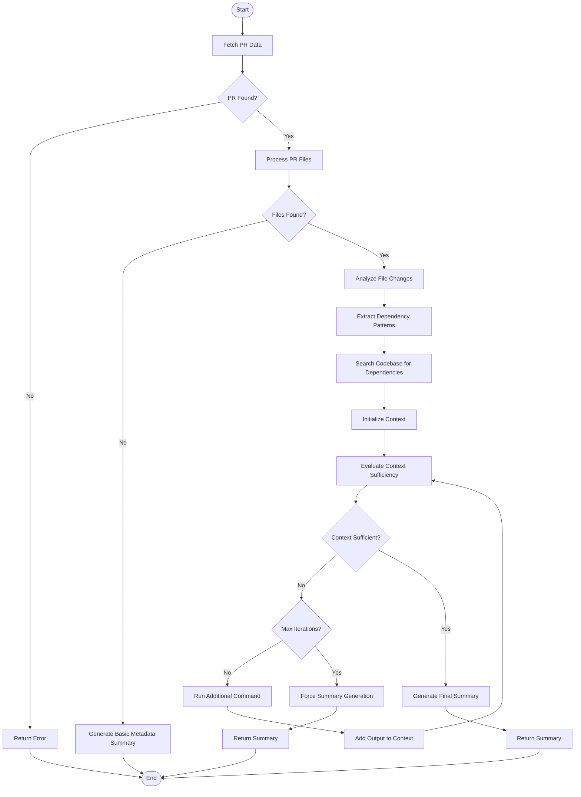

# tldr
> i ain't reading all that. im happy for you tho, or sorry that happened

A tool for summarizing GitHub PRs using LLMs.

## Features

- Summarize GitHub PRs with OpenAI LLMs
- Chat with an AI about the PR details
- Export PR summaries in Markdown for easy copying to GitHub

## Installation

### Install with pip

```bash
pip install git+https://github.com/wandb/tldr.git
```

## Usage

```bash
# Summarize the current PR in the current directory
tldr

# Summarize a PR in a specific repository
tldr /path/to/repo

# Use a specific model (default is gpt-4o)
tldr --model gpt-3.5-turbo

# Start an interactive chat session after summarizing
tldr --chat

# Output summary as Markdown
tldr --md
```

## Run with uvx

To run `tldr` from the `main` branch with `uvx` as a standalone script in an isolated environment, you can run:
```
uvx --from git+https://github.com/wandb/tldr@main tldr
```

## Requirements

- Python 3.8+
- OpenAI API key (set as `OPENAI_API_KEY` environment variable)
- GitHub CLI (`gh`) for accessing PR information
- Git

## Project Structure

The project is organized into modules:

- `utils.py`: Utility functions for file operations and Git
- `git.py`: Functions for working with Git repositories and PRs
- `agent.py`: LLM agent functionality for analyzing PRs
- `chat.py`: Interactive chat functionality
- `cli.py`: Command-line interface
- `__main__.py`: Entry point for the package

# PR Summarization Agent Loop

This diagram outlines the workflow used by the agent for summarizing pull requests:


